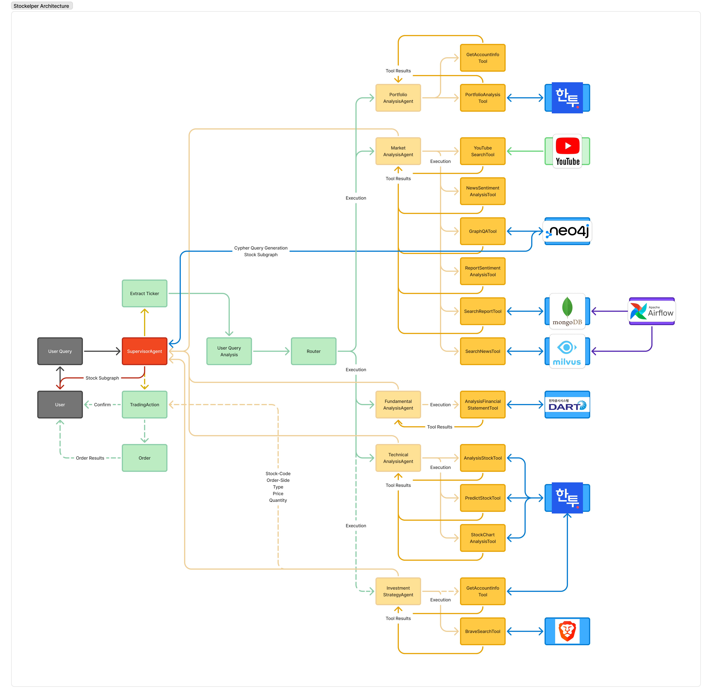
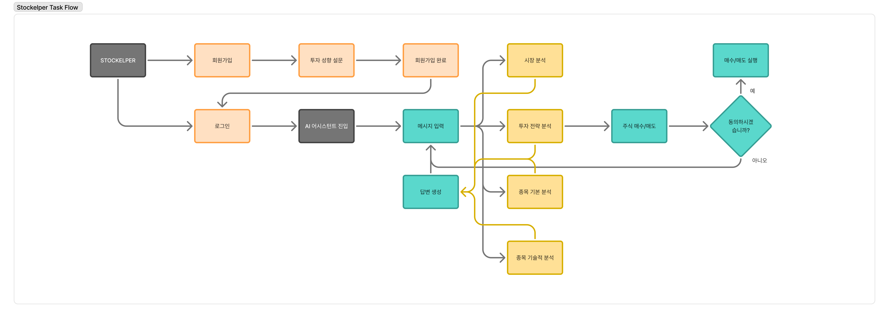
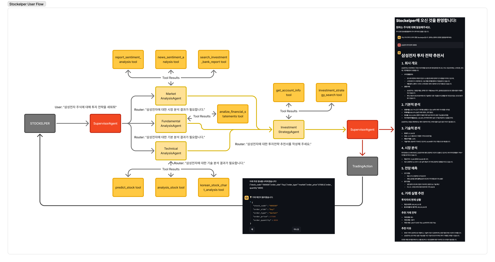

<div align="center">
  
</div>

# Stockelper - Your AI Stock Investment Assistant

Stockelper는 초보 주식 투자자를 위한 LLM 기반 챗봇 서비스입니다. 복잡한 금융 정보를 쉽게 이해하고 투자 결정을 내릴 수 있도록 도와주는 AI 어시스턴트입니다.

## 시스템 아키텍처

Stockelper는 다중 에이전트 시스템을 기반으로 하며, 각 에이전트는 특정 도메인에 전문화되어 복잡한 투자 질문에 답변합니다.



## 태스크 흐름도

사용자 질문이 다양한 에이전트를 통해 처리되는 과정을 보여주는 태스크 흐름도입니다.



## 사용자 흐름도

사용자가 Stockelper와 상호작용하는 전체 과정을 보여주는 사용자 흐름도입니다.



## 주요 에이전트 구성

### 1. SupervisorAgent
- 사용자의 질문을 분석하고 적절한 전문 에이전트에게 작업을 할당하는 관리자 역할
- 각 에이전트의 응답을 조율하고 최종 답변을 생성

### 2. MarketAnalysisAgent
- 시장 동향 및 산업 분석
- 뉴스 기사 감성 분석 및 요약
- 기업 관련 뉴스 및 공시 정보 제공
- 유튜브 컨텐츠 및 지식 그래프 기반 분석

### 3. FundamentalAnalysisAgent
- 기업의 재무제표 분석
- 주요 재무 지표 계산 및 해석
- 동종 업계 기업과의 비교 분석

### 4. TechnicalAnalysisAgent
- 주가 차트 분석 및 기술적 지표 해석
- 주식 가격 분석 및 변동성 예측
- 주식 차트 패턴 분석

### 5. InvestmentStrategyAgent
- 개인 투자자 맞춤형 투자 전략 제안
- 포트폴리오 구성 추천
- 리스크 관리 및 투자 시점 조언
- 계좌 정보 기반 맞춤형 전략

## 에이전트 도구

각 에이전트는 다음과 같은 전문화된 도구들을 활용하여 사용자의 요청을 처리합니다.

### 1. 시장 분석 도구
- `SearchNewsTool`: 벡터 데이터베이스를 활용한 기업 관련 뉴스 검색
- `SearchReportTool`: 전문 투자 리포트 검색 및 분석
- `NewsSentimentAnalysisTool`: 뉴스 기사의 감성 분석 및 트렌드 파악
- `ReportSentimentAnalysisTool`: 투자 리포트의 감성 분석
- `YouTubeSearchTool`: 유튜브에서 주식 관련 콘텐츠 검색 및 분석
- `GraphQATool`: 지식 그래프 기반 질의응답 시스템

### 2. 재무 분석 도구
- `AnalysisFinancialStatementTool`: 기업 재무제표 분석
  - 유동비율, 부채비율, 이익잉여금비율 계산
  - 자본잠식비율, 영업이익, 이자보상배율, ROE 분석
- `AnalysisStockTool`: 종합 주식 분석
  - 시장 정보, 가격 동향, 거래 현황 제공
  - 투자 지표(PER, PBR, EPS, BPS) 분석
  - 외국인 지분율 및 시장 경고 신호 모니터링

### 3. 기술적 분석 도구
- `StockChartAnalysisTool`: 차트 분석 및 기술적 지표 해석
- `PredictStockTool`: 주가 예측 및 변동성 분석

### 4. 투자 전략 도구
- `GetAccountInfoTool`: 사용자 계좌 정보 조회 및 분석
- `BraveSearchTool`: 투자 전략 관련 정보 검색

## 시스템 구성 요소

### 1. LLM Server
- 다중 에이전트 시스템을 호스팅하는 FastAPI 서버
- LangChain과 LangGraph를 활용한 에이전트 오케스트레이션
- 다양한 도구 및 API 통합

### 2. Vector Database
- Milvus를 활용한 고성능 벡터 검색
- 뉴스 및 리포트 임베딩 저장 및 검색
- 의미적 유사성 기반 관련 정보 검색

### 3. MongoDB
- 기업 정보, 뉴스, 리포트 등 구조화된 데이터 저장
- 크롤링된 데이터의 중앙 저장소
- 에이전트를 위한 정보 제공

## 시스템 설치 및 실행 방법

### 사전 요구사항
- Python 3.11+
- Docker 및 Docker Compose
- PostgreSQL
- MongoDB
- Milvus Vector Database

### 환경 설정
1. 저장소 클론
   ```bash
   git clone https://github.com/yourusername/stockelper.git
   cd stockelper
   ```

2. 환경 변수 설정
   ```bash
   cp llm-server/example.env llm-server/.env
   ```
   
3. 환경 변수 파일을 수정하여 필요한 API 키와 서비스 URL을 설정합니다.

### 서비스 실행
1. Docker 네트워크 생성
   ```bash
   docker network create stockelper
   ```

2. 데이터베이스 실행
   ```bash
   cd database
   docker-compose up -d
   ```

3. LLM 서버 실행
   ```bash
   cd llm-server
   docker-compose up -d
   ```

## 기술 스택
- Language: Python
- LLM Framework
  - LangChain (langgraph, langchain-community, langchain-openai)
  - Hugging Face (FlagEmbedding)
- Backend
  - Web Framework: FastAPI, Uvicorn
  - Database: MongoDB, Milvus
  - Monitoring: Langfuse
- Data Analysis
  - Financial Data: finance-datareader, opendartreader
  - Time Series: Prophet, statsmodels
  - Data Processing: NumPy, Plotly

## 라이선스
이 프로젝트는 MIT 라이선스 하에 배포됩니다. 자세한 내용은 [LICENSE](LICENSE) 파일을 참조하세요.

## 기여 방법
이 프로젝트에 기여하고 싶으시다면, 다음 과정을 따라주세요:
1. 이 저장소를 포크합니다.
2. 새로운 브랜치를 생성합니다 (`git checkout -b feature/amazing-feature`).
3. 변경사항을 커밋합니다 (`git commit -m 'Add some amazing feature'`).
4. 브랜치에 푸시합니다 (`git push origin feature/amazing-feature`).
5. Pull Request를 생성합니다.

## 후원사

아래는 Stockelper 프로젝트를 지원해주시는 후원사 목록입니다.

<table>
  <tr>
    <td align="center" width="33%">
      <a href="#">
        
      </a>
    </td>
    <td align="center" width="33%">
      <a href="#">
        
      </a>
    </td>
  </tr>
  <tr>
    <td align="center" width="33%">
      <a href="#">
        
      </a>
    </td>
    <td align="center" width="33%">
      <a href="#">
        
      </a>
    </td>
  </tr>
</table>