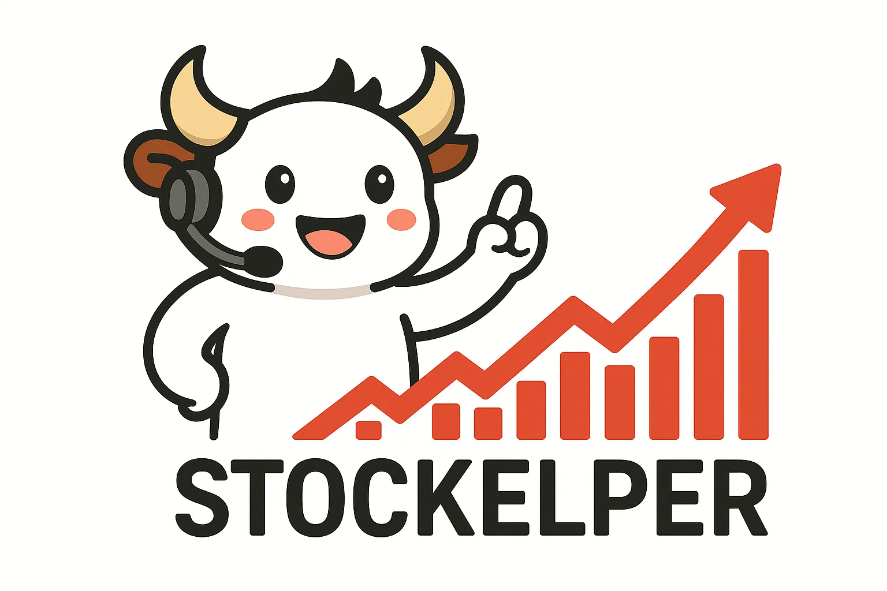
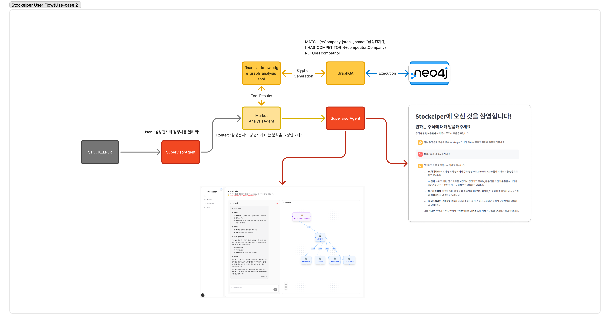

<div align="center">
  
</div>

# Stockelper - AI-Powered Stock Investment Platform

**Stockelper**는 AI 기반의 종합 주식 투자 플랫폼으로, 초보부터 전문가까지 모든 투자자를 위한 지능형 투자 어시스턴트입니다. LangGraph 기반의 다중 에이전트 시스템과 자동화된 데이터 파이프라인을 통해 실시간 시장 분석, 기업 분석, 투자 전략 수립을 지원합니다.

## 🚀 주요 특징

- **🤖 다중 AI 에이전트**: 시장분석, 기업분석, 기술분석, 리스크관리 전문 에이전트
- **📊 실시간 데이터**: Airflow 기반 자동화된 뉴스/리포트 크롤링 파이프라인
- **🔍 지능형 검색**: Neo4j 지식그래프와 벡터 데이터베이스 기반 정보 검색
- **📈 포트폴리오 관리**: 실시간 포트폴리오 추적 및 리스크 분석
- **🌐 오픈소스**: 완전한 오픈소스로 누구나 배포 및 커스터마이징 가능

## 🏗️ 시스템 아키텍처

Stockelper는 마이크로서비스 아키텍처를 기반으로 구성되어 있습니다:


### 핵심 컴포넌트

1. **LLM Server** (`llm-server/`): LangGraph 기반 다중 에이전트 시스템
2. **Data Pipeline**: Airflow 기반 자동화된 데이터 수집 및 처리
3. **Vector Database**: 임베딩 기반 지능형 검색 시스템
4. **Knowledge Graph**: Neo4j 기반 관계형 데이터 분석

## 📋 태스크 흐름도

사용자 질문이 다양한 에이전트를 통해 처리되는 과정:


## 👤 사용자 흐름도

### 기본 사용자 흐름


### 상세 사용자 흐름


## 🤖 AI 에이전트 시스템

### 1. SupervisorAgent (관리자 에이전트)
- 사용자 질문 분석 및 작업 할당
- 에이전트 간 협업 조율
- 최종 응답 생성 및 품질 관리
- 실제 거래 실행 결정

### 2. MarketAnalysisAgent (시장 분석 에이전트)
- 실시간 시장 동향 분석
- 뉴스 감성 분석 및 요약
- 섹터별 시장 분석
- 유튜브/소셜미디어 트렌드 분석
- 지식그래프 기반 관계 분석

### 3. FundamentalAnalysisAgent (기업 분석 에이전트)
- 재무제표 심층 분석
- 기업 가치 평가 (DCF, PER, PBR 등)
- 경쟁사 비교 분석
- ESG 및 지배구조 분석
- DART 공시 정보 분석

### 4. TechnicalAnalysisAgent (기술 분석 에이전트)
- 차트 패턴 인식 및 분석
- 기술적 지표 계산 (RSI, MACD, 볼린저밴드 등)
- 지지/저항선 분석
- 거래량 분석
- 매매 타이밍 추천

### 5. PortfolioAnalysisAgent (포트폴리오 분석 에이전트)
- 포트폴리오 구성 최적화
- 리스크 분산 분석
- 수익률 시뮬레이션

### 6. InvestmentStrategyAgent (투자 전략 에이전트)
- 개인화된 투자 전략 수립
- 리스크 프로파일 기반 추천
- 장기/단기 투자 계획
- 세금 최적화 전략
- KIS API 연동 실제 거래 실행

## 🚀 빠른 시작

### 전체 시스템 배포

```bash
# 1. 저장소 클론
git clone https://github.com/Stockelper-Lab/Stockelper.git
cd Stockelper

# 2. LLM 서버 배포
cd llm-server
cp .env.example .env
# .env 파일에 API 키 설정
./deploy.sh

# 3. 데이터 파이프라인 배포 (별도 터미널)
cd ../stockelper-airflow
cp .env.example .env
# .env 파일에 MongoDB 등 설정
./scripts/deploy.sh
```

### LLM 서버만 배포

```bash
cd llm-server
./deploy.sh
```

배포 완료 후 접속:
- **API 서버**: http://localhost:8000
- **API 문서**: http://localhost:8000/docs
- **Airflow 웹서버**: http://localhost:8080 (admin/admin)

## 📁 프로젝트 구조

```
Stockelper/
├── llm-server/                 # LangGraph 기반 AI 에이전트 시스템
│   ├── src/
│   │   ├── multi_agent/        # 다중 에이전트 구현
│   │   │   ├── supervisor_agent/
│   │   │   ├── market_analysis_agent/
│   │   │   ├── fundamental_analysis_agent/
│   │   │   ├── technical_analysis_agent/
│   │   │   ├── portfolio_analysis_agent/
│   │   │   └── investment_strategy_agent/
│   │   ├── routers/            # FastAPI 라우터
│   │   └── tools/              # 에이전트 도구들
│   ├── database/               # 데이터베이스 초기화
│   ├── docker-compose.yml      # Docker 구성
│   ├── deploy.sh              # 배포 스크립트
│   └── README.md              # LLM 서버 문서
│
├── stockelper-airflow/         # 데이터 파이프라인 (별도 저장소)
│   ├── dags/                  # Airflow DAG 정의
│   ├── modules/               # 크롤링 모듈
│   ├── docker/                # Docker 설정
│   └── scripts/               # 배포 스크립트
│
├── database/                   # 벡터 데이터베이스 설정
│   ├── docker-compose.yaml    # Milvus/Etcd 구성
│   └── embedding_upload.py    # 임베딩 업로드
│
└── assets/                     # 문서 이미지 및 자료
```

## 🔧 기술 스택

### AI/ML
- **LangGraph**: 다중 에이전트 워크플로우
- **LangChain**: LLM 애플리케이션 프레임워크
- **OpenAI GPT**: 주요 언어 모델
- **Anthropic Claude**: 보조 언어 모델
- **HuggingFace**: 임베딩 모델

### 데이터베이스
- **PostgreSQL**: 사용자 데이터 및 체크포인트
- **Neo4j**: 지식 그래프
- **MongoDB**: 문서 저장소
- **Milvus**: 벡터 데이터베이스

### 인프라
- **Docker**: 컨테이너화
- **FastAPI**: API 서버
- **Apache Airflow**: 데이터 파이프라인
- **Langfuse**: AI 관찰성 및 모니터링

### 외부 API
- **KIS API**: 한국투자증권 거래 API
- **DART API**: 금융감독원 공시 시스템
- **FinanceDataReader**: 금융 데이터
- **Tavily**: 웹 검색
- **YouTube API**: 동영상 콘텐츠

## 🔑 필수 API 키

### AI 서비스
- `OPENAI_API_KEY`: OpenAI GPT 모델
- `ANTHROPIC_API_KEY`: Claude 모델 (선택사항)
- `TAVILY_API_KEY`: 웹 검색

### 관찰성
- `LANGFUSE_HOST`: Langfuse 클라우드 호스트
- `LANGFUSE_PUBLIC_KEY`: Langfuse 공개 키
- `LANGFUSE_SECRET_KEY`: Langfuse 비밀 키

### 데이터 서비스
- `NEO4J_URI`: Neo4j 데이터베이스
- `NEO4J_USERNAME`: Neo4j 사용자명
- `NEO4J_PASSWORD`: Neo4j 비밀번호
- `MONGODB_URI`: MongoDB 연결 문자열

### 거래 API (선택사항)
- `KIS_APP_KEY`: 한국투자증권 앱 키
- `KIS_APP_SECRET`: 한국투자증권 앱 시크릿
- `KIS_ACCESS_TOKEN`: 한국투자증권 액세스 토큰

## 📊 API 사용 예시

### 종합 분석 요청
```bash
curl -X POST "http://localhost:8000/analyze" \
  -H "Content-Type: application/json" \
  -d '{
    "query": "삼성전자 주식에 대한 종합적인 투자 분석을 해주세요",
    "analysis_type": "comprehensive"
  }'
```

### 스트리밍 분석
```bash
curl -X POST "http://localhost:8000/analyze/stream" \
  -H "Content-Type: application/json" \
  -d '{
    "query": "현재 반도체 시장 전망은 어떤가요?",
    "stream": true
  }'
```

### 특정 에이전트 호출
```bash
curl -X POST "http://localhost:8000/agent/market-analysis" \
  -H "Content-Type: application/json" \
  -d '{
    "query": "최근 NVIDIA 관련 뉴스 분석",
    "symbols": ["NVDA"]
  }'
```

## 🛠️ 개발 가이드

### 로컬 개발 환경 설정

```bash
# Python 환경 설정
cd llm-server
python -m venv venv
source venv/bin/activate  # Windows: venv\Scripts\activate
pip install -r requirements.txt

# 환경변수 설정
cp .env.example .env
# .env 파일 편집

# 개발 서버 실행
uvicorn src.main:app --reload --host 0.0.0.0 --port 8000
```

### 새로운 에이전트 추가

1. `src/multi_agent/` 디렉토리에 새 에이전트 폴더 생성
2. `BaseAnalysisAgent`를 상속받는 에이전트 클래스 구현
3. 에이전트별 도구(tools) 구현
4. `SupervisorAgent`에 라우팅 로직 추가

### 새로운 도구 추가

1. `src/tools/` 또는 각 에이전트의 `tools/` 디렉토리에 도구 구현
2. LangChain 도구 인터페이스 준수
3. 에이전트 초기화 시 도구 바인딩

## 🔒 보안 고려사항

- 모든 API 키는 환경변수로 관리
- Docker 컨테이너는 non-root 사용자로 실행
- 데이터베이스 접근은 최소 권한 원칙 적용
- HTTPS 사용 권장 (프로덕션 환경)
- 정기적인 의존성 업데이트

## 📈 모니터링 및 관찰성

- **Langfuse**: AI 에이전트 추적 및 성능 모니터링
- **Docker Health Checks**: 서비스 상태 모니터링
- **PostgreSQL Logs**: 데이터베이스 쿼리 로깅
- **FastAPI Logs**: API 요청/응답 로깅

## 🤝 기여하기

1. Fork the repository
2. Create a feature branch (`git checkout -b feature/amazing-feature`)
3. Commit your changes (`git commit -m 'Add amazing feature'`)
4. Push to the branch (`git push origin feature/amazing-feature`)
5. Open a Pull Request

### 개발 가이드라인

- 코드 스타일: Black, isort 사용
- 테스트: pytest 기반 단위 테스트 작성
- 문서화: docstring 및 README 업데이트
- 커밋 메시지: Conventional Commits 규칙 준수

## 📄 라이선스

이 프로젝트는 MIT 라이선스 하에 배포됩니다. 자세한 내용은 [LICENSE](LICENSE) 파일을 참조하세요.

## 🆘 지원 및 문의

- **Issues**: [GitHub Issues](https://github.com/Stockelper-Lab/Stockelper/issues)
- **Discussions**: [GitHub Discussions](https://github.com/Stockelper-Lab/Stockelper/discussions)
- **Documentation**: 각 컴포넌트별 README 파일 참조

## 🔄 업데이트 로그

### v2.0.0 (2025-01-26)
- 🚀 완전한 오픈소스 배포 준비 완료
- 🤖 LangGraph 기반 다중 에이전트 시스템 구현
- 🐳 Docker 기반 원클릭 배포 시스템
- 🌐 클라우드 Langfuse 통합
- 🔒 모든 민감한 정보 제거 및 환경변수화
- 📚 포괄적인 문서화 및 API 가이드
- 🛠️ 자동화된 배포 스크립트
- 📊 실시간 모니터링 및 헬스체크

---

<div align="center">
  <strong>Stockelper로 더 스마트한 투자를 시작하세요! 🚀📈</strong>
</div>
- 주요 재무 지표 계산 및 해석
- 동종 업계 기업과의 비교 분석

### 4. TechnicalAnalysisAgent
- 주가 차트 분석 및 기술적 지표 해석
- 주식 가격 분석 및 변동성 예측
- 주식 차트 패턴 분석

### 5. PortfolioAnalysisAgent
- 사용자 계좌 정보 분석
- 포트폴리오 성과 분석 및 평가
- 자산 배분 및 다각화 분석
- 포트폴리오 리스크 평가

### 6. InvestmentStrategyAgent
- 개인 투자자 맞춤형 투자 전략 제안
- 포트폴리오 구성 추천
- 리스크 관리 및 투자 시점 조언
- 계좌 정보 기반 맞춤형 전략

## 에이전트 도구

각 에이전트는 다음과 같은 전문화된 도구들을 활용하여 사용자의 요청을 처리합니다.

### 1. 시장 분석 도구
- `SearchNewsTool`: 벡터 데이터베이스를 활용한 기업 관련 뉴스 검색
- `SearchReportTool`: 전문 투자 리포트 검색 및 분석
- `NewsSentimentAnalysisTool`: 뉴스 기사의 감성 분석 및 트렌드 파악
- `ReportSentimentAnalysisTool`: 투자 리포트의 감성 분석
- `YouTubeSearchTool`: 유튜브에서 주식 관련 콘텐츠 검색 및 분석
- `GraphQATool`: 지식 그래프 기반 질의응답 시스템

### 2. 재무 분석 도구
- `AnalysisFinancialStatementTool`: 기업 재무제표 분석
  - 유동비율, 부채비율, 이익잉여금비율 계산
  - 자본잠식비율, 영업이익, 이자보상배율, ROE 분석
- `AnalysisStockTool`: 종합 주식 분석
  - 시장 정보, 가격 동향, 거래 현황 제공
  - 투자 지표(PER, PBR, EPS, BPS) 분석
  - 외국인 지분율 및 시장 경고 신호 모니터링

### 3. 기술적 분석 도구
- `StockChartAnalysisTool`: 차트 분석 및 기술적 지표 해석
- `PredictStockTool`: 주가 예측 및 변동성 분석

### 4. 포트폴리오 분석 도구
- `GetAccountInfoTool`: 사용자 계좌 정보 및 투자 내역 조회
- `PortfolioAnalysisTool`: 포트폴리오 성과 분석, 자산 배분 최적화, 리스크 평가

### 5. 투자 전략 도구
- `BraveSearchTool`: 투자 전략 관련 정보 검색

## 시스템 구성 요소

### 1. LLM Server
- 다중 에이전트 시스템을 호스팅하는 FastAPI 서버
- LangChain과 LangGraph를 활용한 에이전트 오케스트레이션
- 다양한 도구 및 API 통합

### 2. Vector Database
- Milvus를 활용한 고성능 벡터 검색
- 뉴스 및 리포트 임베딩 저장 및 검색
- 의미적 유사성 기반 관련 정보 검색

### 3. MongoDB
- 기업 정보, 뉴스, 리포트 등 구조화된 데이터 저장
- 크롤링된 데이터의 중앙 저장소
- 에이전트를 위한 정보 제공

## 시스템 설치 및 실행 방법

### 사전 요구사항
- Python 3.11+
- Docker 및 Docker Compose
- PostgreSQL
- MongoDB
- Milvus Vector Database

### 환경 설정
1. 저장소 클론
   ```bash
   git clone https://github.com/yourusername/stockelper.git
   cd stockelper
   ```

2. 환경 변수 설정
   ```bash
   cp llm-server/example.env llm-server/.env
   ```
   
3. 환경 변수 파일을 수정하여 필요한 API 키와 서비스 URL을 설정합니다.

### 서비스 실행
1. Docker 네트워크 생성
   ```bash
   docker network create stockelper
   ```

2. 데이터베이스 실행
   ```bash
   cd database
   docker-compose up -d
   ```

3. LLM 서버 실행
   ```bash
   cd llm-server
   docker-compose up -d
   ```

## 기술 스택
- Language: Python
- LLM Framework
  - LangChain (langgraph, langchain-community, langchain-openai)
  - Hugging Face (FlagEmbedding)
- Backend
  - Web Framework: FastAPI, Uvicorn
  - Database: MongoDB, Milvus
  - Monitoring: Langfuse
- Data Analysis
  - Financial Data: finance-datareader, opendartreader
  - Time Series: Prophet, statsmodels
  - Data Processing: NumPy, Plotly

## 라이선스
이 프로젝트는 MIT 라이선스 하에 배포됩니다. 자세한 내용은 [LICENSE](LICENSE) 파일을 참조하세요.

## 기여 방법
이 프로젝트에 기여하고 싶으시다면, 다음 과정을 따라주세요:
1. 이 저장소를 포크합니다.
2. 새로운 브랜치를 생성합니다 (`git checkout -b feature/amazing-feature`).
3. 변경사항을 커밋합니다 (`git commit -m 'Add some amazing feature'`).
4. 브랜치에 푸시합니다 (`git push origin feature/amazing-feature`).
5. Pull Request를 생성합니다.

## 후원사

아래는 Stockelper 프로젝트를 지원해주시는 후원사 목록입니다.

<table>
  <tr>
    <td align="center" width="25%">
      <a href="#">
        
      </a>
    </td>
    <td align="center" width="25%">
      <a href="#">
        
      </a>
    </td>
    <td align="center" width="25%">
      <a href="#">
        
      </a>
    </td>
    <td align="center" width="25%">
      <a href="#">
        
      </a>
    </td>
  </tr>
</table>